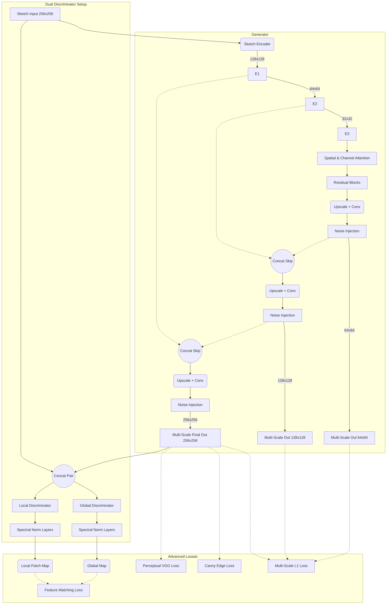

# Architecture Diagram for Attention Guided Multi-Scale Dual-Discriminator Sketch GAN

```mermaid
graph TD
  SK[Sketch Input 256x256] --> ENC
  
  subgraph Generator
    ENC(Sketch Encoder) -->|128x128| E1
    E1 -->|64x64| E2
    E2 -->|32x32| E3
    E3 --> SA[Spatial & Channel Attention]
    SA --> RB[Residual Blocks]
    
    RB --> UP1(Upscale + Conv)
    UP1 --> N1[Noise Injection]
    N1 -->|64x64| D1[Multi-Scale Out 64x64]
    
    N1 -.-> C1
    E2 -.-> C1
    C1((Concat Skip)) --> UP2(Upscale + Conv)
    UP2 --> N2[Noise Injection]
    N2 -->|128x128| D2[Multi-Scale Out 128x128]
    
    N2 -.-> C2
    E1 -.-> C2
    C2((Concat Skip)) --> UP3(Upscale + Conv)
    UP3 --> N3[Noise Injection]
    N3 -->|256x256| D3[Multi-Scale Final Out 256x256]
  end
  
  subgraph Dual Discriminator Setup
    D3 & SK --> CAT((Concat Pair))
    CAT --> GD[Global Discriminator]
    CAT --> LD[Local Discriminator]
    
    GD --> SN1[Spectral Norm Layers]
    LD --> SN2[Spectral Norm Layers]
  end
  
  SN1 --> OR(Global Map)
  SN2 --> LR(Local Patch Map)
  
  subgraph Advanced Losses
    OR -.-> FM[Feature Matching Loss]
    LR -.-> FM
    D3 -.-> PL[Perceptual VGG Loss]
    D3 -.-> EL[Canny Edge Loss]
    D1 & D2 & D3 -.-> L1[Multi-Scale L1 Loss]
  end
```
